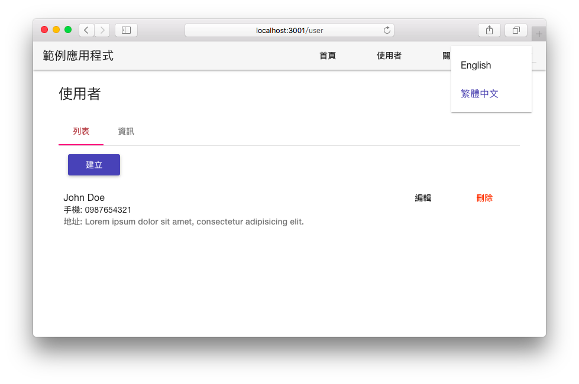

# Angular ES2015 DemoApp

> An Angular ES2015 demo application using Angular, AngularUI Router, Angular Translate and Angular Material.

- Angular
- AngularUI Router
- Angular Translate
- Angular Material
- Webpack
- Babel
- ESLint
- BrowserSync

### Screenshots





### Requirement

`Node >= 4.0.0`

### Usage

Install dependencies:
```sh
$ npm install
```

Rename `db.json.example` to `db.json` and start the JSON API server:
```sh
$ mv db.json.example db.json
$ npm run api-server
```

#### Development

Open another terminal and running below command:
```sh
$ npm start
```

`http://localhost:3001` will automatic open in your browser with browser-sync.

#### Production

Build the bundle js:
```sh
$ npm run build
```

Start the production server:
```sh
$ npm run prod
```

Open `http://localhost:3000` in your browser.

### Test

```sh
$ npm run clean && karma start
```

> The `npm test` has some bugs and I will fixed it later.

### Scaffold

```sh
$ gulp make --name={name} --path={path} [--route]
```

- `name`: component name.
- `path`: component path.
- `route`: if you set `--route` option that will stubing route config for your module.

For example, if you execute `gulp make --name=create --path=posts --route`, it will generate following files and include route config:

```
src/
└── components
    └── posts
        └── create
            ├── create.controller.js
            ├── create.css
            ├── create.html
            ├── create.js
            └── create.spec.js
```

### Referencies
- https://github.com/AngularClass/NG6-starter
- https://github.com/nihgwu/hexo-hey
